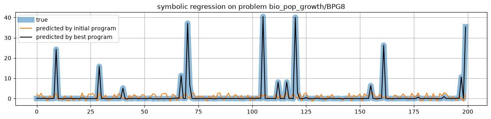
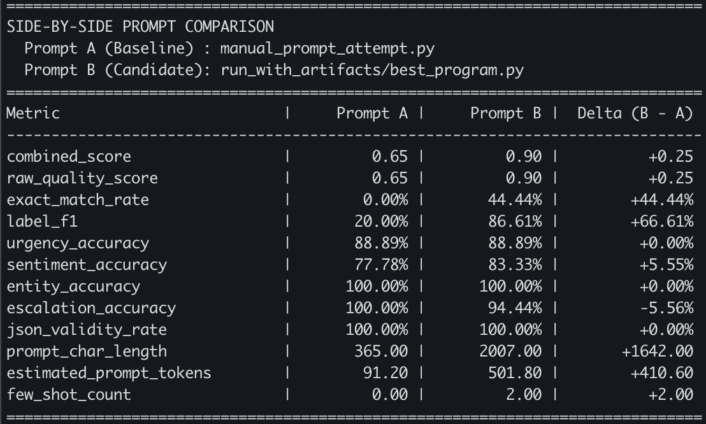

# OpenEvolve Lab

A hands-on lab for exploring LLM-guided evolutionary search with **OpenEvolve** (an open-source implementation of DeepMind's AlphaEvolve). You will learn how MAP-Elites, island populations, and evaluator feedback work together to evolve code and prompts automatically across tasks such as **function minimization**, **symbolic regression**, and **prompt optimization**.





---

## 1. Setup & Installation

### 1.1 Configure & Verify Your LLM API Key

Have an API key for your favorite OpenAI-compatible LLM ready. You can get one for free for small usage from [OpenRouter](https://openrouter.ai/) (the `openrouter/free` model wraps multiple free models).

Verify that your API key works using [`call_model.py`](./call_model.py):

- **Option A — Using OpenRouter:**
  ```bash
  export OPENAI_COMPATIBLE_API_KEY="your-openrouter-api-key"
  export OPENAI_COMPATIBLE_URL="https://openrouter.ai/api/v1"
  export MODEL="openrouter/free"
  python call_model.py "what is the meaning of life"
  ```

- **Option B — Using Google Gemini:**
  ```bash
  export OPENAI_COMPATIBLE_API_KEY="your-gemini-api-key"
  export OPENAI_COMPATIBLE_URL="https://generativelanguage.googleapis.com/v1beta/openai"
  export MODEL="gemini-3.5-flash"
  python call_model.py "what is the meaning of life"
  ```

### 1.2 Clone & Configure `openevolve`

Clone the `openevolve` repository:

```bash
git clone https://github.com/algorithmicsuperintelligence/openevolve.git
```

Set `primary_model`, `secondary_model`, and `api_base` in `openevolve/examples/function_minimization/config.yaml` to `"openrouter/free"` and `"https://openrouter.ai/api/v1"` (or whichever model and endpoint you are using).

### 1.3 Run Your First Evolution & Visualize Results

Run a short 5-iteration evolution on the function minimization example (note that upstream `openevolve` reads `$OPENAI_API_KEY`):

```bash
cd openevolve
export OPENAI_API_KEY=${OPENAI_COMPATIBLE_API_KEY}
python openevolve-run.py examples/function_minimization/initial_program.py \
         examples/function_minimization/evaluator.py \
         --config examples/function_minimization/config.yaml \
         --iterations 5
```

Inspect the generated output folder:

```bash
ls -R examples/function_minimization/openevolve_output/
```

Launch the interactive results visualizer:

```bash
python -m openevolve.web.app
python scripts/visualizer.py
```

---

## 2. Understand How `openevolve` Works

Open your favorite AI coding assistant in this repository and interrogate it about the `openevolve` architecture.

For example, try asking:

- *"Inspect the code under `openevolve` and give me an overview of how OpenEvolve works."*
- *"Explain in detail what happens during each step of one iteration."*
- *"When OpenEvolve starts with only my initial program, how does it initialize the islands?"*
- *"How does it ensure that child programs in different islands remain diverse?"*
- *"Explain in detail how code mutation happens."*
- *"Give me an example of a full mutation prompt."*
- *"Explain the difference between the primary and secondary models in an OpenEvolve configuration."*

See [my conversation log](conversation.md) for the full Q&A session I had with Antigravity/Jetski using Google Gemini.

> **Tip:** Before you start, you can ask your coding assistant to keep a running transcript of your session:
> *"From now on, save every turn of this conversation in a file named `conversation.md`, including the questions I ask and the answers you give me."*

---

## 3. Understand the Sample Run

Inspect the files in `openevolve/examples/function_minimization/`:

1. **Inputs (what you set up before running `openevolve`)**:
   - `initial_program.py`: The starting baseline program with `# EVOLVE-BLOCK-START ... # EVOLVE-BLOCK-END` markers.
   - `config.yaml`: LLM ensemble, island database, MAP-Elites grid, and evaluator settings.
   - `evaluator.py`: The deterministic scoring function that grades candidate programs.
2. **Outputs (what `openevolve` produces)**:
   - Explore `openevolve_output/` to understand how checkpoints, best programs, and metadata are organized.

You can use `jq` to pretty-print any JSON file:

```bash
jq . metadata.json
jq . best_program_info.json
```

Or ask your coding assistant to analyze the run:

- *"Based on `openevolve/examples/function_minimization/openevolve_output/`, please summarize the results of the run."*
- *"How many tokens were used in each iteration?"*

> **Note:** Out of the box, OpenEvolve does **not** log token counts—so your assistant might make a wild guess on that last question! Observe whether your coding assistant catches this fact and how it handles it. See how Antigravity/Jetski handled it in [my conversation](conversation.md).

---

## 4. Modify `openevolve` to Log Token Usage

Since `openevolve` does not log token usage by default, modify `openevolve` so that it logs prompt and completion token counts for every LLM call.

You can ask your coding assistant:

- *"Modify `openevolve` so that it logs the tokens used in each LLM call."*

Then re-run `openevolve` for 10 iterations:

```bash
python openevolve-run.py examples/function_minimization/initial_program.py \
         examples/function_minimization/evaluator.py \
         --config examples/function_minimization/config.yaml \
         --iterations 10
```

Now ask your coding assistant again:

- *"Summarize the results of the run and include a token usage analysis so that I can estimate the cost per iteration."*

---

## 5. Run and Inspect Domain Examples

### Option A: Symbolic Regression

Under `openevolve/examples/symbolic_regression/`, you will find an implementation of **symbolic regression** (discovering a mathematical formula that fits data points) across physics, chemistry, and biology datasets.

Follow the instructions there, choose a problem to evolve, and use the notebook [`inspect_symbolic_regresion.ipynb`](./inspect_symbolic_regresion.ipynb) to inspect and visualize the evolutionary trajectory.

**Prerequisites:**
- Install required Python libraries (`h5py`, `scipy`, etc.).
- Create a Hugging Face account and log in locally via `hf auth login`.
- Accept the dataset terms of use on Hugging Face for `nnheui/llm-srbench`.

> **Suggestions:**
> - Try problems `matsci/MatSci18` or `bio_pop_growth/BPG8`, where the initial program performs poorly and leaves plenty of room for evolution.
> - Remember to update each problem's `config.yaml` with your desired models—or set `primary_model`, `secondary_model`, and `api_base` in `openevolve/examples/symbolic_regression/data_api.py` before generating the problem folders.
> - Use the following commands to launch a run:
>   ```bash
>   export OPENEVOLVE_CONFIG_BASEDIR=examples/symbolic_regression/problems/matsci/MatSci18
>   python openevolve-run.py ${OPENEVOLVE_CONFIG_BASEDIR}/initial_program.py \
>                            ${OPENEVOLVE_CONFIG_BASEDIR}/evaluator.py \
>                            --config ${OPENEVOLVE_CONFIG_BASEDIR}/config.yaml \
>                            --iterations 10
>   ```

Use your coding assistant to debug any issues you encounter along the way. For example, on `MatSci18`, the run initially stalled at a large negative score without evolving—see [my conversation](conversation.md) for how we diagnosed and fixed it.

### Option B: Prompt Optimization

Under [`example_prompt_optimization/`](./example_prompt_optimization/README.md), you will find a complete standalone lab for quantitative **prompt optimization**—starting with manual prompt engineering by hand and progressing to closed-loop evolutionary search with OpenEvolve.

**Problem & Benchmark Setup:**
- **Task**: Evolve a parameterized prompt program (`build_messages(ticket_text)`) that instructs an LLM to classify enterprise support tickets and extract structured JSON (`intent_labels`, `urgency`, `sentiment`, `extracted_entities`, and `requires_human_escalation`).
- **Adversarial Dataset ([`dataset.py`](./example_prompt_optimization/dataset.py))**: 18 curated tickets spanning 6 failure modes (`sarcasm_outage`, `multi_intent`, `resolved_negation`, `security_pii`, `entity_edge_cases`, and `benign_routine`), plus a fast 5-ticket Stage-1 canary gate.
- **Evaluator ([`evaluator.py`](./example_prompt_optimization/evaluator.py))**: Grades multi-label F1, urgency, sentiment, entity extraction, human escalation, and clean raw JSON formatting while applying a token bloat penalty and returning diagnostic **artifacts**.

** Progressive Hands-On Exercises ([full guide](./example_prompt_optimization/README.md)):**
1. **Inspect, Evaluate & Beat the Baseline by Hand**: Trace how single tickets are scored, benchmark `initial_program.py`, and hand-engineer an improved prompt in [`manual_prompt_attempt.py`](./example_prompt_optimization/manual_prompt_attempt.py).
2. **Failure Mode Autopsy Across Categories**: Diagnose why fixing one category by hand (e.g., sarcasm or resolved false alarms) often breaks multi-intent recall or disputed vs. total monetary extraction.
3. **The Power of Artifact Feedback (Blind Evolution vs. Textual Gradients)**: Run an A/B experiment comparing blind scalar evolution (`--no-artifacts`) against artifact-guided evolution where `category_accuracy_summary` and `failure_cases_report` provide exact field-level diffs to the mutator LLM.
4. **Quality-Diversity & Pareto Exploration with MAP-Elites**: Explore the accuracy-vs-token-budget Pareto frontier across 2D feature grids (`prompt_char_length` $\times$ `few_shot_count`, or custom `--feature-dims`).
5. **Customizing the Fitness Function & Cascade Gate**: Tune token budget penalties in `evaluator.py` and Stage-1 cascade pruning thresholds in `config.yaml`.
