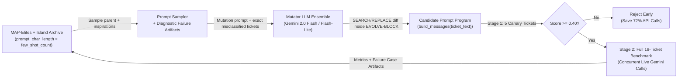

# OpenEvolve Prompt Optimization Lab: Multi-Label Triage & Structured JSON Extraction

Welcome to the **OpenEvolve Prompt Optimization Lab**! In this hands-on workshop, you will learn the fundamentals of quantitative **prompt optimization**—starting with manual prompt engineering by hand, and progressing to closed-loop evolutionary optimization using **OpenEvolve** (an open-source implementation of DeepMind's AlphaEvolve paradigm).

---

## 🎯 What is Prompt Optimization? (For Newcomers)

When engineers first build LLM applications, they typically write a prompt based on intuition, test it on 2 or 3 examples by eye ("vibes-based evaluation"), and ship it. As soon as real traffic arrives, edge cases break the prompt: fixing sarcasm breaks polite requests; adding a rule for refunds causes false positives on resolved billing questions.

**Prompt Optimization** turns prompt writing into rigorous software engineering by defining three components:
1. **The Parameterized Prompt Program ($P$)**: A function [`build_messages(ticket_text)`](./initial_program.py) that takes an input and produces the system instructions + optional few-shot demonstrations sent to the LLM.
2. **The Gold Benchmark Dataset ($\mathcal{D}$)**: A fixed set of diverse, adversarial inputs paired with ground-truth expected outputs $\{(x_i, y_i)\}_{i=1}^N$ ([`dataset.py`](./dataset.py)).
3. **The Deterministic Evaluator ($S$)**: An automated grading function ([`evaluator.py`](./evaluator.py)) that runs $P$ against every $x_i \in \mathcal{D}$, compares the LLM's prediction $\hat{y}_i$ against $y_i$, and returns both **continuous fitness metrics** (`combined_score`) and **diagnostic failure artifacts**.



---

## 📦 Standalone Setup (Any Shell / Zero Monorepo Dependencies)

This lab kit is **100% standalone** and requires only Python 3.10+ and a Gemini API key:

```bash
# 1. Install dependencies in any virtualenv or shell
pip install -r requirements.txt

# 2. Export your OpenAI-compatible API key and endpoint
export OPENAI_API_KEY="your-api-key"
export OPENAI_COMPATIBLE_URL="https://generativelanguage.googleapis.com/v1beta/openai"
export MODEL="gemini-3.5-flash-lite"

# 3. Inspect the baseline prompt structure (no API call required)
python3 test_harness.py --show-prompt initial_program.py
```

---

## 📁 Lab Kit Anatomy

| File | Role |
| :--- | :--- |
| [`dataset.py`](./dataset.py) | 18 curated support tickets across 6 adversarial failure modes (`sarcasm_outage`, `multi_intent`, `resolved_negation`, `security_pii`, `entity_edge_cases`, `benign_routine`) + a 5-ticket Stage-1 canary subset. |
| [`initial_program.py`](./initial_program.py) | The baseline candidate module. Contains `SYSTEM_PROMPT` and `build_messages(ticket_text)` inside `# EVOLVE-BLOCK-START ... # EVOLVE-BLOCK-END`. |
| [`manual_prompt_attempt.py`](./manual_prompt_attempt.py) | Your editable starter file for **Exercise 1**, where you will engineer a better prompt by hand and compare it against `initial_program.py`. |
| [`evaluator.py`](./evaluator.py) | Live Gemini evaluator (`evaluate_stage1`, `evaluate_stage2`, `evaluate`). Scores multi-label F1, urgency, sentiment, entity extraction, and escalation, while returning structured **failure-case artifacts**. |
| [`config.yaml`](./config.yaml) | Configures the evolutionary loop: Gemini OpenAI-compatible endpoint, meta-prompting system instructions, cascade thresholds, and MAP-Elites feature dimensions (`prompt_char_length` × `few_shot_count`). |
| [`test_harness.py`](./test_harness.py) | Standalone CLI tool to inspect prompts (`--show-prompt`), trace single tickets (`--inspect-ticket`), run full benchmark scorecards, or compare two prompts side-by-side (`--compare`). |
| [`run_lab.py`](./run_lab.py) | Main evolution launcher with CLI flags for artifact ablation (`--no-artifacts`) and MAP-Elites dimension experiments (`--feature-dims`). |

---

## 🧪 Hands-On Lab Exercises (5 Progressive Modules)

---

### Exercise 1: What is Prompt Optimization? Inspect, Evaluate & Beat the Baseline by Hand (25 min)

> **Goal**: Before letting an AI evolve prompts automatically, you must understand how a prompt program works, how the evaluator grades it, and what it feels like to optimize a prompt **by hand**.

#### Step 1.1: Inspect How `initial_program.py` Works
Open [`initial_program.py`](./initial_program.py) in your editor and run the prompt structure inspector:

```bash
python3 test_harness.py --show-prompt initial_program.py
```

Notice what `initial_program.py` actually is:
- It defines a Python string `SYSTEM_PROMPT` and a function `build_messages(ticket_text: str) -> list[dict]`.
- The code to optimize sits between `# EVOLVE-BLOCK-START` and `# EVOLVE-BLOCK-END`.
- Right now, the baseline prompt is only **365 characters (~91 tokens)** with **0 few-shot examples**—it doesn't even list the allowed `intent_labels` taxonomy!

#### Step 1.2: Trace How a Single Ticket is Evaluated End-to-End
How does `evaluator.py` turn an LLM response into a numeric score? Run the single-ticket walkthrough on ticket `TCK-001` (a sarcastic outage ticket):

```bash
python3 test_harness.py --inspect-ticket TCK-001 initial_program.py
```

Examine all 5 sections of the walkthrough output:
1. **Input Support Ticket**: The raw customer message (*"Oh bravo, truly 10/10 engineering! Our production cluster on account ACC-90412 just vaporized 36 hours of customer transaction tables..."*).
2. **Messages Sent to Gemini**: The exact `[system, user]` payload returned by `build_messages()`.
3. **Raw Model Output**: The literal text returned by Gemini (notice whether it wrapped the output in ` ```json ` markdown fences!).
4. **Expected Gold JSON vs. Parsed Model JSON**: Side-by-side view of ground truth vs. prediction.
5. **Field-by-Field Rubric Grading**: How the evaluator grades the 5 sub-tasks:
   - `intent_labels` Multi-Label F1 ($30\%$ weight)
   - `urgency` exact match: `P0`–`P3` ($20\%$ weight)
   - `sentiment` exact match: `positive`, `neutral`, `negative`, `critical_negative` ($15\%$ weight)
   - `extracted_entities` match: `account_or_invoice_id` + numeric `monetary_amount_usd` ($15\%$ weight)
   - `requires_human_escalation` boolean match ($15\%$ weight)
   - Clean raw JSON bonus (no markdown fences, $5\%$ weight)

Try inspecting two other tricky categories to see different failure modes:
```bash
# A resolved false alarm where keywords 'outage' and 'double charge' appear:
python3 test_harness.py --inspect-ticket TCK-007 initial_program.py

# A billing dispute where both total billed ($1,750.25) and discrepancy ($500.25) appear:
python3 test_harness.py --inspect-ticket TCK-013 initial_program.py
```

#### Step 1.3: Evaluate the Baseline Across the Full 18-Ticket Benchmark
Now run the complete evaluation scorecard on `initial_program.py`:

```bash
python3 test_harness.py initial_program.py
```

Record your baseline numbers:
- Baseline `combined_score`: `________`
- Baseline `exact_match_rate`: `________%`
- Baseline `prompt_char_length`: `365 chars`

#### Step 1.4: Hands-On Challenge — Engineer a Better Prompt by Hand!
Open [`manual_prompt_attempt.py`](./manual_prompt_attempt.py) in your editor. Your challenge is to manually rewrite `SYSTEM_PROMPT` and/or `build_messages(ticket_text)` inside the `# EVOLVE-BLOCK-START ... # EVOLVE-BLOCK-END` markers to maximize `combined_score`.

**Ideas to try in `manual_prompt_attempt.py`:**
1. Explicitly list the 10 allowed `intent_labels` from [`dataset.py`](./dataset.py) (`outage`, `data_loss`, `billing_dispute`, `refund_request`, `security_incident`, `privacy_gdpr_request`, `account_access`, `feature_request`, `documentation_request`, `general_feedback`).
2. Add rules for **sarcasm** (*praise during an outage/data loss = `critical_negative` sentiment & `P0` urgency*).
3. Add rules for **resolved/negated mentions** (*if the customer says the issue is resolved or a false alarm, do NOT tag `outage`/`billing_dispute` and set `requires_human_escalation: false`*).
4. Add a **few-shot example** pair (`{"role": "user", ...}`, `{"role": "assistant", ...}`) in `build_messages()`.
5. Enforce **raw JSON output without markdown fences**.

#### Step 1.5: Evaluate & Compare Your Hand-Crafted Prompt Against the Baseline
Run the side-by-side comparison harness between `initial_program.py` and your `manual_prompt_attempt.py`:

```bash
python3 test_harness.py --compare initial_program.py manual_prompt_attempt.py
```

**Reflection Questions before Moving to Exercise 2:**
- How much did your `combined_score` and `exact_match_rate` improve over the baseline?
- How many characters/tokens did your prompt grow by (`Delta` on `prompt_char_length`)?
- Did fixing one category (e.g., sarcasm or escalation) accidentally hurt another category, or leave subtle edge cases unresolved?
- *This exact tension—balancing multi-field accuracy across 6 adversarial categories while controlling prompt length—is why we use automated evolutionary search in Exercises 2–5!*

---

### Exercise 2: Failure Mode Autopsy Across Categories (15 min)

Review the per-category breakdown and top diagnostic failure cases from Exercise 1 (`sarcasm_outage`, `multi_intent`, `resolved_negation`, `security_pii`, `entity_edge_cases`, `benign_routine`). Notice how each failure category requires distinct decision logic:
1. **Multi-Intent Completeness** (`TCK-004`, `TCK-005`, `TCK-006`): Tickets containing both a security incident / GDPR request *and* a refund request require multi-label recall, not just single-label classification.
2. **Disputed vs. Gross Monetary Amounts** (`TCK-003`, `TCK-013`, `TCK-014`): When multiple dollar amounts appear in a ticket, the model must extract the *actionable disputed/refund amount* as a JSON float (`500.25`), or JSON `null` when absent.

---

### Exercise 3: The Power of Artifact Feedback — Blind Evolution vs. Textual Gradients (30 min)

#### What is Artifact Feedback?

In standard evolutionary algorithms, the mutator only sees **scalar fitness numbers** (e.g., `combined_score: 0.4812`, `sentiment_accuracy: 0.5556`). The mutating LLM knows *how well* a candidate prompt scored overall, but is completely blind to *which tickets failed*, *what the model predicted*, and *why it lost points*. Without diagnostic context, mutations degrade into random trial-and-error guessing.

In OpenEvolve, [`evaluator.py`](./evaluator.py) returns an `EvaluationResult(metrics=..., artifacts=...)` object:
- **`metrics`** (`dict[str, float]`): Numeric scores used by MAP-Elites and island selection to rank and archive programs.
- **`artifacts`** (`dict[str, str]`): Unstructured text diagnostics (error logs, per-category breakdowns, field diffs, compiler tracebacks) that OpenEvolve automatically injects into the **mutation prompt** sent to the LLM when `prompt.include_artifacts: true` is enabled in [`config.yaml`](./config.yaml).

Because these artifacts show the exact discrepancy between expected ground truth and actual model output, they act as **textual gradients**—giving the mutator LLM explicit directional signal on what rules, taxonomy definitions, or few-shot examples to add next.

#### Concrete Examples of Artifacts Produced by `evaluator.py`

Our evaluator attaches two diagnostic artifacts to every evaluation run:

**1. `category_accuracy_summary` (Macro-level failure localization across the 6 adversarial slices):**
```text
Per-Category Exact Match Rates:
  - benign_routine: 1.0/3 (33.3%)
  - entity_edge_cases: 0.0/3 (0.0%)
  - multi_intent: 0.0/3 (0.0%)
  - resolved_negation: 0.0/3 (0.0%)
  - sarcasm_outage: 0.0/3 (0.0%)
  - security_pii: 0.0/3 (0.0%)
```

**2. `failure_cases_report` (Micro-level field-by-field diffs on misclassified tickets):**
```text
[TCK-001 | category=sarcasm_outage]
  * Output wrapped in markdown code fences instead of raw JSON
  * intent_labels: expected ['data_loss', 'outage'], got ['general_feedback']
  * urgency: expected 'P0', got 'P3'
  * sentiment: expected 'critical_negative', got 'positive'
  * requires_human_escalation: expected True, got False
[TCK-013 | category=entity_edge_cases]
  * monetary_amount_usd: expected 500.25, got 1750.25
```

When the mutator LLM sees those two artifacts in its prompt, it immediately recognizes:
- From `TCK-001`: *"The target model is wrapping output in ` ```json ` fences and misclassifying sarcastic praise during an outage as `positive` / `P3`."*
- From `TCK-013`: *"When both total billed (`$1,750.25`) and disputed discrepancy (`$500.25`) appear, the target model extracts the total instead of the disputed amount."*

#### Controlled A/B Experiment: Blind Evolution vs. Artifact-Guided Evolution

Run a controlled A/B experiment comparing **blind scalar evolution** (`--no-artifacts`) against **artifact-guided evolution** (default).
*(Tip: You can start from `initial_program.py` OR pass `--initial-program manual_prompt_attempt.py` to evolve from your own hand-crafted prompt!)*

```bash
# Run A: Blind Evolution (LLM only sees numeric scores, no failing ticket details)
python3 run_lab.py --iterations 15 --no-artifacts --output-dir run_blind

# Run B: Artifact-Guided Evolution (LLM sees exact misclassified tickets & field diffs)
python3 run_lab.py --iterations 15 --output-dir run_with_artifacts
```

Compare the two evolved prompts directly (and compare against your manual attempt from Exercise 1!):

```bash
python3 test_harness.py --compare run_blind/best_program.py run_with_artifacts/best_program.py
python3 test_harness.py --compare manual_prompt_attempt.py run_with_artifacts/best_program.py
```

**Instructor Discussion Points:**
- Notice how `run_with_artifacts` rapidly synthesizes decision rules for **sarcasm masking P0 outages**, **resolved/false-alarm filtering**, and **disputed vs. gross monetary amounts** because `failure_cases_report` acts as a concrete textual gradient.
- Inspect the generated `best_program.py` in both folders to see how OpenEvolve's `SEARCH/REPLACE` diff mutations evolved `SYSTEM_PROMPT` and `build_messages()`.

---

### Exercise 4: Quality-Diversity & Pareto Exploration with MAP-Elites (30 min)

In production systems, the highest-accuracy prompt is not always the best prompt if it consumes **2,500 input tokens per call** at 10,000 QPS. You often want the entire **Pareto frontier** of prompts:
- **Cell (Low Tokens, 0-Shot)**: Best ultra-compact zero-shot system prompt (< 800 chars) for high-throughput routing.
- **Cell (Medium Tokens, 2-Shot)**: Best balanced prompt with 2 canonical demonstrations.
- **Cell (High Tokens, 4-Shot)**: Maximum accuracy prompt with comprehensive edge-case demonstrations.

In `config.yaml`, MAP-Elites indexes every candidate into a 2D feature grid:

```yaml
database:
  feature_dimensions:
    - "prompt_char_length"
    - "few_shot_count"
  feature_bins:
    prompt_char_length: 8
    few_shot_count: 5
```

Try running evolution with alternative MAP-Elites behavioral dimensions to see how archive diversity changes:

```bash
# Explore the trade-off between prompt length and multi-label F1 accuracy:
python3 run_lab.py --iterations 20 \
  --feature-dims prompt_char_length label_f1 \
  --output-dir run_pareto_length_vs_f1

# Explore the trade-off between few-shot count and sentiment accuracy:
python3 run_lab.py --iterations 20 \
  --feature-dims few_shot_count sentiment_accuracy \
  --output-dir run_pareto_fewshot_vs_sentiment
```

**Key Takeaway:** Because MAP-Elites preserves the highest-scoring prompt *within each grid cell* rather than keeping only a single global winner, concise prompts are never overwritten by verbose few-shot prompts. They evolve in parallel and cross-pollinate via island migration!

---

### Exercise 5: Customizing the Fitness Function & Cascade Gate (20 min)

Open [`evaluator.py`](./evaluator.py) and inspect the composite fitness formula:

```python
raw_quality_score = (
    0.30 * label_f1
    + 0.20 * urgency_acc
    + 0.15 * sentiment_acc
    + 0.15 * entity_acc
    + 0.15 * escalation_acc
    + 0.05 * clean_json_rate
)
token_penalty = max(0.0, (est_tokens - 1200.0) * 0.00005)
combined_score = max(0.0, round(raw_quality_score - token_penalty, 4))
```

**Challenge Tasks:**
1. **Strict Token Budgeting**: Tighten the token budget threshold from `1200.0` tokens down to `350.0` tokens (`~1,400 chars`) and increase the penalty slope to `0.0005`. Re-run `python3 run_lab.py --iterations 15 --output-dir run_strict_budget`. Watch OpenEvolve compress verbose prose into dense, high-precision decision tables!
2. **Cascade Threshold Calibration**: In `config.yaml`, adjust `evaluator.cascade_thresholds: [0.40]` to `[0.65]`. Measure how much faster 20 iterations run when mediocre mutations are pruned after evaluating only the 5 Stage-1 canary tickets.
